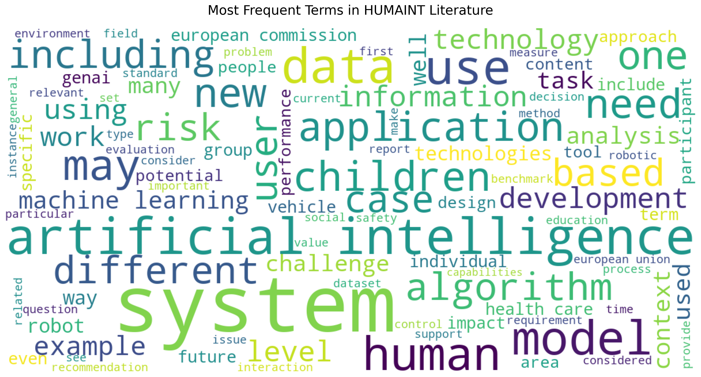

# AI Research Landscape Assessment
## HUMAINT Publications Analysis

**Generated:** 2025-10-08 11:07:49

---

## Executive Summary

This landscape assessment analyzes **42 research publications** from the European Commission's HUMAINT initiative on AI and society.

- **Total corpus size:** 710,142 words
- **Unique terms:** 24,304
- **Average document length:** 16908 words
- **Document range:** 1,659 to 77,338 words

## Key Research Themes

Based on frequency analysis, the most prominent themes include:

1. **Data** (3,031 occurrences)
2. **Systems** (2,579 occurrences)
3. **Health** (1,857 occurrences)
4. **European** (1,647 occurrences)
5. **Technology** (1,599 occurrences)
6. **Intelligence** (1,594 occurrences)
7. **Human** (1,573 occurrences)
8. **Also** (1,424 occurrences)
9. **Use** (1,364 occurrences)
10. **System** (1,310 occurrences)

## Discovered Research Topics

## Key Areas for Public Policy Students

Based on this landscape analysis, the following research areas are prominent:

### AI Governance & Regulation
*Relevance score: 7558 term occurrences*

This area focuses on regulation, policy, governance, act and related concepts.

### AI Ethics & Fairness
*Relevance score: 2534 term occurrences*

This area focuses on ethical, fairness, bias, discrimination and related concepts.

### AI & Society
*Relevance score: 6001 term occurrences*

This area focuses on social, society, human, impact and related concepts.

### AI Technology & Innovation
*Relevance score: 13514 term occurrences*

This area focuses on learning, model, algorithm, data and related concepts.

### AI Applications
*Relevance score: 2754 term occurrences*

This area focuses on healthcare, autonomous, driving, education and related concepts.

## Visualizations

The following visualizations are available in the `visualizations/` folder:

1. **Word Cloud** - Visual representation of most frequent terms
2. **Document Length Distribution** - Histogram of document sizes
3. **Top Words Chart** - Bar chart of 20 most common terms
4. **Topic Distribution** - Distribution of documents across topics

## Recommendations for Further Research

1. **Deep Dive into Specific Topics** - Use the topic assignments to cluster related research
2. **Citation Network Analysis** - Map relationships between publications
3. **Temporal Analysis** - Track evolution of themes over time
4. **Policy Gap Analysis** - Identify under-researched policy areas
5. **Stakeholder Mapping** - Analyze author networks and institutional affiliations

## Available Data Files

- `data/extracted_texts.json` - Full text of all documents
- `data/corpus_statistics.json` - Detailed statistics
- `data/topic_assignments.csv` - Document-topic mappings (see below)

---

*This assessment was generated using state-of-the-art NLP techniques including BERTopic and transformer-based models.*
